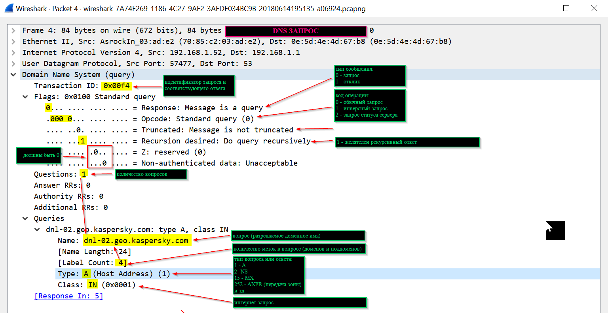
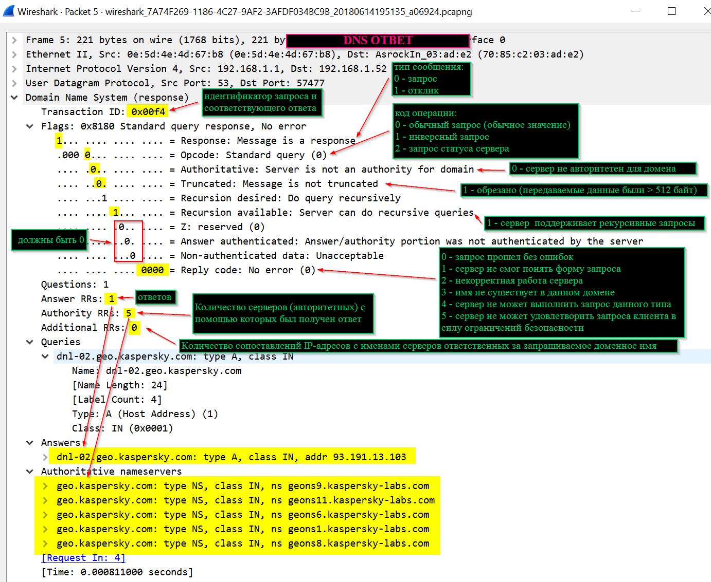

## Выявление туннелей в DNS трафике
##### Обычный DNS запрос

##### Обычный DNS ответ

##### Признаки инициирования туннеля в пакете DNS запроса (на примере программы для построения туннелей ==[iodine](https://github.com/yarrick/iodine)==)

##### Пакет DNS запроса с признаками туннеля при передаче через него данных

##### Пакет DNS запроса с признаками туннеля при передаче через него данных

