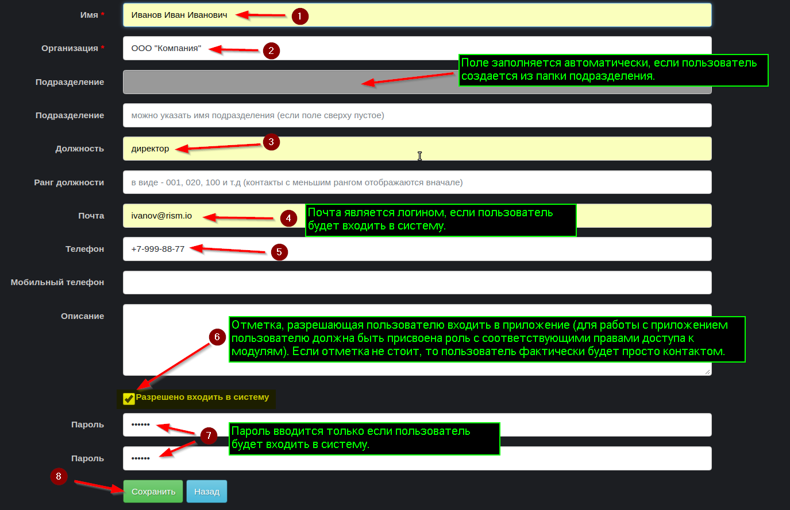

##### [RISM](../index.md)
##### [Главная страница](../../index.md)
### Основные сведения о приложении (системе)
Приложение RISM помогает вести учет информации, связанной с обеспечением информационной безопасности организации.

Приложение состоит из функциональных модулей, которые решают следующие задачи:
* Ведение структуры организаций и контактных данных их работников.
* Учет инцидентов информационной безопасности.
* Учет договоров (соглашений и договоров о конфиденциальности).
* Контроль сетевого периметра организации из вне (сетевое сканирование).
* Учет прочей информации, связанной с обеспечением информационной безопасности.

Фактически приложение представляет собой базу данных и веб интерфейс к ней.

В указанной базе данных каждому модулю приложения соответствует своя таблица, в которой можно сохранять, редактировать и искать записи, относящиеся к учитываемым объектам (организациям, контактам, инцидентам).

Большинство таблиц базы данных хранят записи (объекты), которые относятся к определенной организации, что позволяет (при необходимости) строить иерархические структуры организаций и разграничивать доступ к объектам базы основываясь на принадлежности пользователей к тем или иным организациям.

При использовании системы для учета сведений нескольких организаций, рекомендуется в качестве основной страницы, на которой производястя действия с учитываемыми объектами использовать страницу конкретной организации - карточку организации.

В системе имеется встроенная организация "Общедоступные организации" (может быть переименована), которую удобно использовать для размещения в ней сведений, которые должны быть доступны всем работникам в иерархии организаций (не встроенным в приложение ролям требуется явное назначение прав к объектам данной организации).

Если иерархия организаций не используется, то можно размещать все объекты в данной организации.

#### Архитектура приложения
Приложение состоит из следующих основных частей:
* Веб приложение [RISM](https://github.com/atilla777/rism), которое построено с помощью веб-фреймворка [Ruby on Rails](https://rubyonrails.org/), который в свою очередь написан на языке программирования [Ruby](https://www.ruby-lang.org/en/). По сути приложение обеспечивает веб-интерфейс для базы данных и связывает воедино все компоненты приложения.
* Веб сервер [Nginx](http://nginx.org/ru/) - принимает запросы веб-браузеров пользователей, передает их веб-приложению и возвращает ответы веб-приложения пользователям.
* Сервер управления базами данных (СУБД) [Postgresql](https://www.postgresql.org) - хранит учитываемые в приложения объекты.
* Сервер выполнения фоновых задач (например, по сетевому сканированию) [Sidekiq](https://sidekiq.org), который в качестве хранилища своих данных (очередей задач) использует сервер [Redis]( https://redis.io/)
* Операционная система (ОС) **Linux**, на которой работают все перечисленные выше компоненты.

### Вход в систему
После установки в программе имеется одна учетная запись **admin@rism.io** пароль которой **password** (настоятельно рекомендуется сменить логин на свой email и установить стойкий пароль).

### Навигация в системе
Для перехода к модулю (таблице с объектами определенного типа) используется меню навигации и (или) закладки в карточке организации.

При переходе к модулю отображается список объектов (записи таблицы базы данных), при этом доступны функции поиска (фильтрации) и сортировки записей.

Пример фильтрации (поиска)

Для просмотра всех свойств конкретного объекта (атрибутов записи таблицы базы данных) необходимо кликнуть на его название.

Так, например, при переходе на объект типа "организация"

 открывается карточка организации - страница со свойствами организации и закладками, предоставляющими доступ к объектам других типов (модулям программы), которые относятся к данной организации.

Для просмотра всех доступных пользователю объектов, а не только тех, которые относятся к конкретной организации, необходимо перейти к соответствующему модулю по ссылке в главном меню.
### Начало работы
После установки системы она полностью готова к работе, но в зависимости от целей использования может потребоваться создать иерархию организаций и подразделений, создать роли и назначить им права доступа, завести пользователей и назначить им роли, заполнить справочную информацию (типы организаций и договоров, типы тегов и связей между объектами, опции сканирования и т.п.).
#### Создание типа организации

#### Создание организации

#### Создание подразделения

#### Создание пользователя

