-##### [Главная страница](../../index.md)
##### [RISM](../index.md)
## [Исследования и индикаторы компрометации](./rism/investigation/index.md)
### Общие сведения о модуле
Модуль предназначен для учета сведений об исследованиях событий информационной безопасности и связанных с этими событиями индикаторов компрометации.

Все связанные с конкретным событием индикаторы компрометации группируются в одно исследование (бюллетень).

Возможные сценарии ведения учета исследований (индикаторов):
* учет данных о самостоятельно исследуемых событиях информационной безопасности в ходе работ по выявлению инцидентов (учет **исследований**)
* учет информации об исследованиях, выполненных другими лицами, например, каким-либо CERT, (учет **бюллетеней**)

### Исследования (бюллетени)
Просмотреть исследования принадлежащие какой-либо организации (созданные её пользователями) можно в карточке данной организации.

Там же можно создать новое исследование.

Переход в карточку конкретной организации
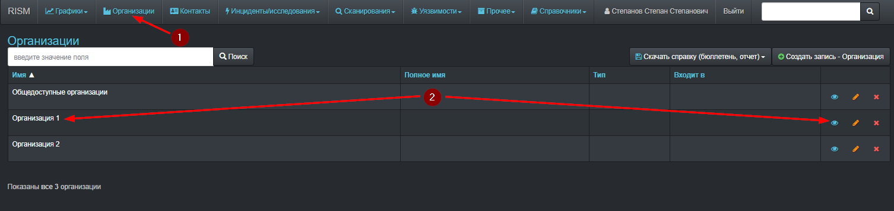

Переход на вкладку исследований
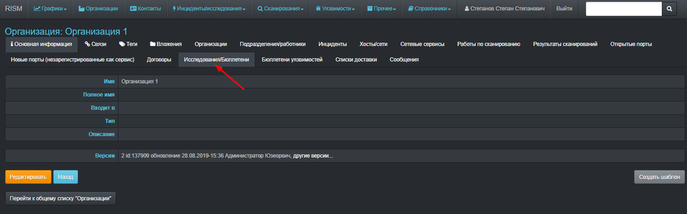

Вкладка принадлежащих организации исследований
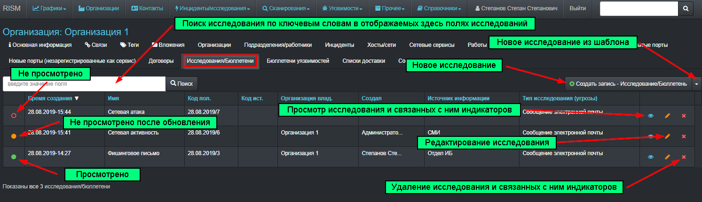

##### Создание нового исследования
Вызвать форму создания нового исследования можно нажав соответствующую кнопку (1). Эта кнопка доступна как в закладке исследований в карточке организации, так и в общем списке исследований всех организаций.

При наличии соответствующего шаблона создать новое исследование можно вызвав (2) список доступных шаблонов и выбрав в нем необходимый шаблон (3).

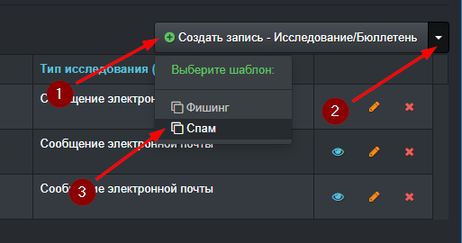

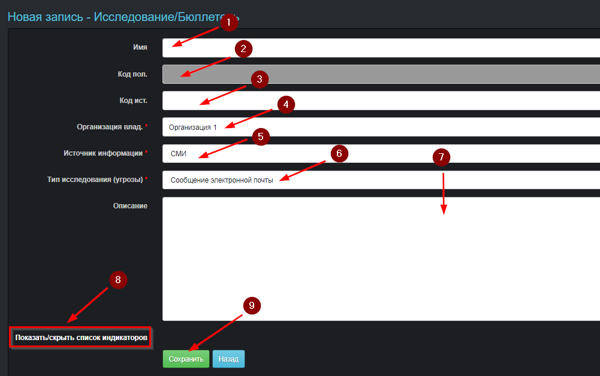
Описание полей формы создания исследования:
* **Имя** (1) - краткое название исследование, если не указать, то данное поле автоматически будет установлено равным полю типа исследования
* **Код пол.** (2) - автоматически создаваемый уникальный номер исследования
> Номер состоит из текущей даты, буквенного кода организации и номера исследования в текущие сутки (от 1)
При создании исследования можно сразу создать и обогатить связанные с ним индикаторы.
* **Код ист.** (3) - номер, присвоенный исследованию (бюллетеню) первоисточником информации об исследовании и индикаторах
* **Организация влад.** (4) - организация которая является владельцем исследования
* **Источник информации** (5) -  первоисточник информации об исследовании (бюллетени) и индикаторах
* **Тип исследования** (6) - тип угрозы или исследуемой информации, с которой связано создаваемое исследование
* **Описание** (7) - информация (в свободной форме) об исследовании, которую нельзя передать с помощью других полей формы
* **Показать/скрыть список индикаторов** (8) - нажатие по ссылке показывает поле для причисления создаваемых вместе с исследование индикаторов (индикаторы исследования можно создавать и позже, после создания исследования, при этом будет доступно больше возможностей по заданию свойств индикаторов). Тип создаваемых таким образом индикаторов определяется автоматически по их формату или по записанным пользователям текстовым префиксам, при этом у всех индикаторов назначением будет **Поиск**
* **Сохранить** (9) - сахранить исследование и связанные с ним индикаторы

Пример заполнения поля индикаторов после нажатия на ссылку "Показать/скрыть список индикаторов" внизу формы создания исследования
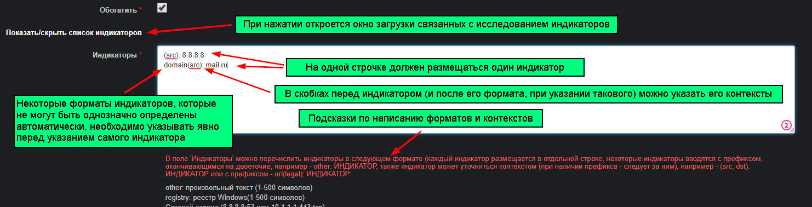
Аналогично можно создать сразу несколько индикаторов при создании нового индикатора.

Данные для поля 4 выбираются при наборе первых символов названия организации (автоподстановка).

Данные для полей 5 и 6 задаются в справочнике (для редактирования справочника необходимы специальные права доступа)
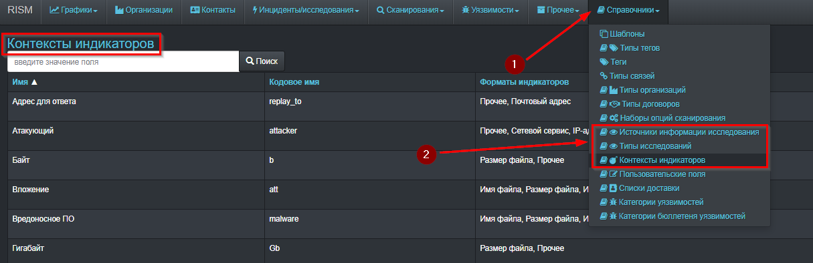
В справочнике можно посмотреть описание определенного в нём поля
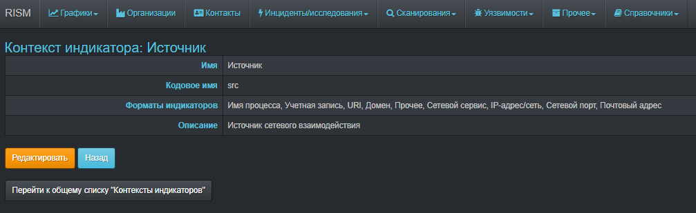
### Индикаторы компрометации
##### Список индикаторов
Для просмотра списка связанных с исследованием бюллетеней необходимо перейти на страницу конкретного исследования (кнопка просмотра или ссылка с его именем в строке индикатора) и потом выбрать вкладку **Индикаторы**
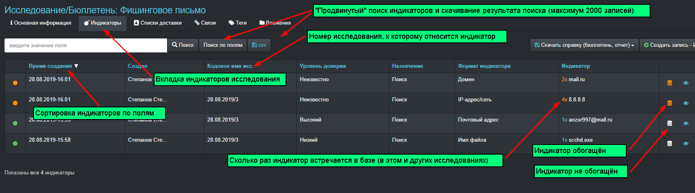

##### Создание нового индикатора
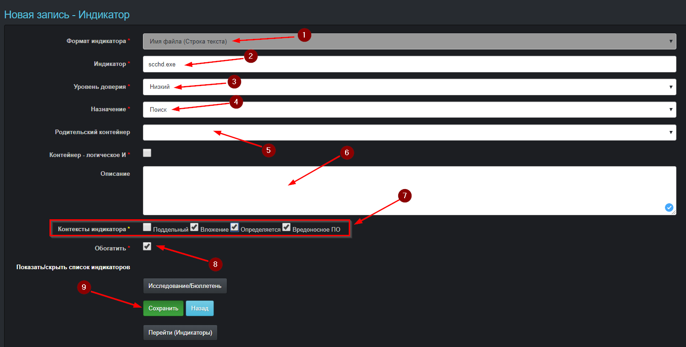
Описание полей формы создания индикатора:
* **Формат индикатора (1)** - формат или тип данных, представляющих его содержание
* **Индикатор (2)** - непосредственно значение, позволяющее использовать индикатор для поиска (блокировки) угроз
* **Уровень доверия (3)** - степень того, насколько можно доверять информации об индикаторе (например, насколько авторитетен первоисточник сведений о нём)
* **Назначение (4)** - как рекомендуется и (или) возможно использовать индикатор - только для поиска признаков угроз (поиск) или и для их предотвращения (блокировка)
* **Родительский контейнер (5)** - индикатор исследования к которому относится (с кем связан) данный индикатор (например, для хеш-суммы это может быть название файла, с которого такая сумма была снята)
> **Контейнер - логическое И** - определяет логическое условие по которому дочерние для данного индикатора индикаторы позволяют выявить угрозу (по умолчания это условие равно ИЛИ, то есть обнаружение любого из дочерних индикаторов будет говорить об обнаружении угрозы связанной с родительским индикатором)
* **Описание (6)** - текстовая информация в произвольной форме, позволяющая передать ту информацию об индикаторе, которую нельзя сообщить с помощью других полей
* **Контексты (7)** - конкретизация того, чем в исследуемом событий является индикатор. Например, для индикатора формата "IP-адрес" уточнением может быть то, что этот адрес является источником сетевого взаимодействия (**Источник**) и принадлежит атакующему сетевому узлу (**Атакующий**), скомпрометированному злоумышленником (**Скомпрометированный**)
* **Обогатить (8)** - дополнить (после сохранения) индикатор информацией из специализированных сервисов Интернета (например, Virustotal)
* **Сохранить (9)** - сохранить новый индикатор
Также исследование можно создать на странице общего списка исследований всех организаций (на этой странице отображаются только те исследования, которые относятся к организациям доступ к которым есть у пользователя).

##### Обогащение индикаторов
Обогащение индикаторов информацией из сервисов Интернета выполняется в фоновом режиме и может быть запущено при создании исследования с индикаторами, при создании индикаторов или после создания индикаторов.

О завершении обогащения свидетельствует изменения цвета соответствующего значка с белого на оранжевый (см. рисунок со списком индикаторов). При нажатии на такой значок можно быстро перейти на вкладку обогащений индикатора.

Эти сведения можно использовать при анализе индикатора для определения уровня доверия к нему и его назначения.

Информацию об обогащении индикатора можно посмотреть на соответствующей вкладке после перехода к конкретному индикатору
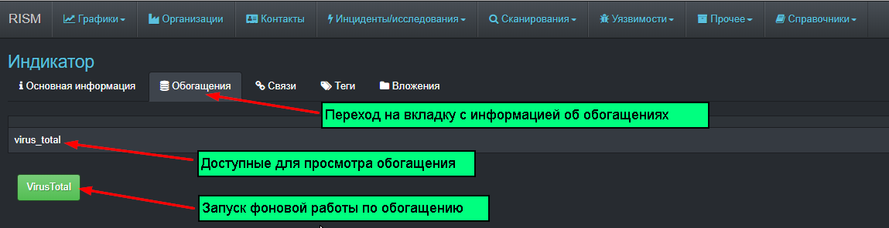
Информация обогащения с конкретного сервиса Интернета
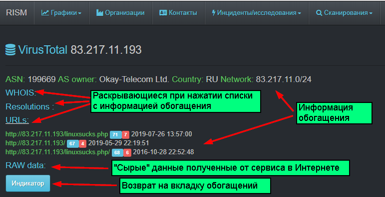

##### Индикаторы всех доступных пользователю организаций
В модуле имеется общий список индикаторов всех доступных пользователю исследований 
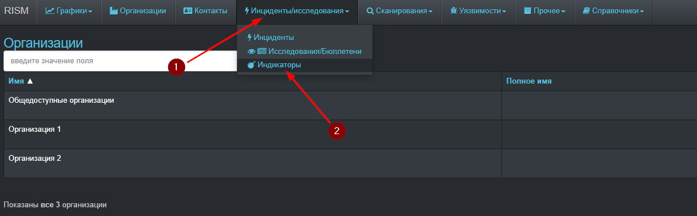
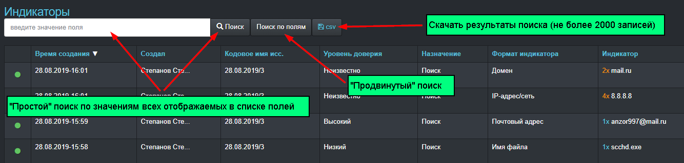
#### Поиск (фильтрация) индикаторов
Помимо простого поиска по всем отображаемым в списке индикаторов полям, также доступен "продвинутый" поиск, при котором можно задавать значения для каждого конкретного поля
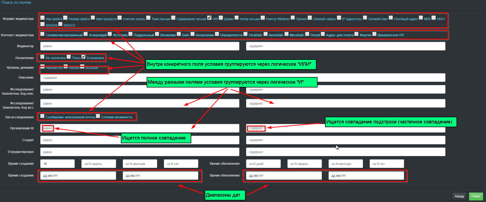

При задании критерием поиска значений нескольких типов полей, будут искаться записи, удовлетворяющие всем заданным условиям (логические **И**).

Созданные условия поиска можно сохранять и использовать повторно
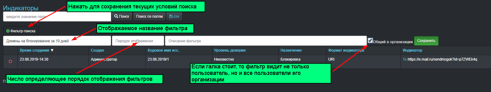
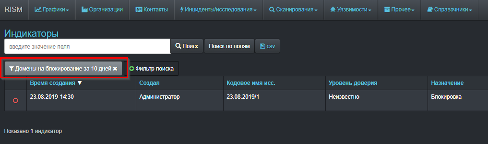
### Экспорт данных
Сведения об исследовании и связанных с ним индикаторах можно скачать со страницы соответсвующего индикатора в виде файлов **docx** и 
**csv**

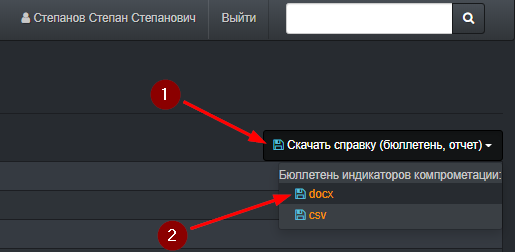

Значения всех доступных пользователю последних индикаторов (за сутки) можно выгрузить в виде текстовых файлов (можно использовать для импорта в средства защиты информации)
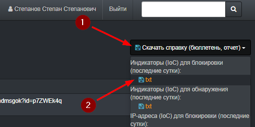
