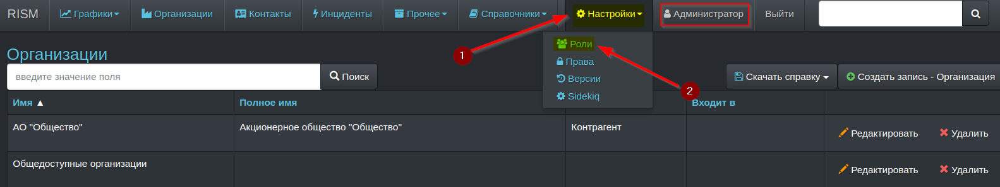
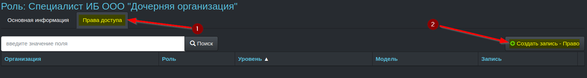
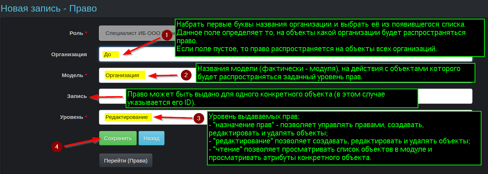
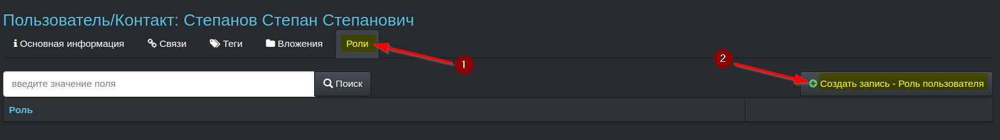
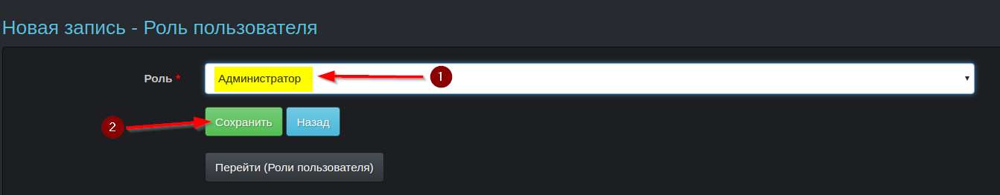

##### [Главная страница](../../index.md)
##### [RISM](../index.md)
## Управление доступом и разграничение прав
Приложение позволяет разграничить доступ к модулям (таблицам) и хранимым объектам (записям таблицы).

Рекомендуются следующие варианты организации разграничения доступа
* Если с системой работает один-два человека в одной организации, то каждому из них можно назначить роль встроенного администратора, обеспечив таким образом полный доступ ко всей системе и ее объектам.
* Если система используется в одной организации и с ней работает несколько человек, то с помощью встроенных ролей (администратор, редактор и читатель) можно назначить одного-двух администраторов (доверенные работники, понимающие как работает система), которые будут управлять правами доступа в системе, несколько редакторов (работники, которые будут участвовать в создании и редактировании записей) и читателей (лица, которым нельзя доверить ведение информации в базе и/или которым достаточно только просматривать ее).
* Если система будет использовать несколькими работниками которым необходим разный доступ к объектам принадлежащим разным организациям и/или система будет использоваться в разных организациях, работники которых должны иметь доступ только к объектам, принадлежащим их организациям можно создать роли редакторов и читателей в объектов конкретных организаций.

Порядок организации разграничения прав доступа в системе следующий
* Создается роль
* Для роли задаются права ее доступа
* Создаются учетные записи пользователей
* Учетным записям добавляются необходимые роли

### Создание роли
Создавать роли может только администратор (прочим пользователям меню **Настройки** недоступно).

### Задание прав доступа для роли
Права доступа для роли могут назначать для
* модуля (таблицы записей определённого типа, например, пользователей) в целом - в этом случае роль будет иметь возможность выполнения разрешенных действий с записями принадлежащими любой организации
* записей модуля, принадлежащей определенной организации - в этом случае роль будет иметь возможность выполнения разрешенных действий с записями принадлежащими указанной в праве организации
* конкретной записи - в этом случае роль будет иметь возможность выполнения разрешенных действий с записью номер (ID) которой указан в праве

Для перечисленных выше типов объектов доступа в правах могут задаваться следующие разрешенные действия (привилегии)
* назначение прав - роль может определять права доступа для других ролей
* редактирование - роль может создавать, удалять, редактировать и просматривать информацию записей
* чтение - роль может только просматривать информацию о записях (записи)

В системе имеются встроенные роли, которые могут осуществлять все перечисленные выше действия (в соответствии с их уровнем привилегий) в отношении записей (объектов) любых организаций
* администратор - имеет все привилегии (может совершать любые действия)
* редактор - имеет привилегии редактирования
* читатель - имеет привилегии чтения

Сразу после установки в системе имеется одна четная запись **Администратор** с ролью администратора.

Логин этой учетно записи - **rism@admin.io**
ее пароль - **password**

После первого входя в систему указанные выше логин и пароль настоятельно рекомендуется сменить.

В качестве логинов в системе используются значение поля **email** записи пользователя.

В качестве паролей может выступать любая комбинация символов, длиной не менее 6 символов (рекомендуется использовать [стойкие пароли](https://ru.wikipedia.org/wiki/%D0%A1%D0%BB%D0%BE%D0%B6%D0%BD%D0%BE%D1%81%D1%82%D1%8C_%D0%BF%D0%B0%D1%80%D0%BE%D0%BB%D1%8F)).
#### Создание прав доступа выполняется следующим образом
Права доступа рекомендуется создавать (редактировать) непосредственно на странице роли, для которой эти права создаются, хотя это можно сделать и со страницы списка всех прав

### Добавление роли учетной записи

