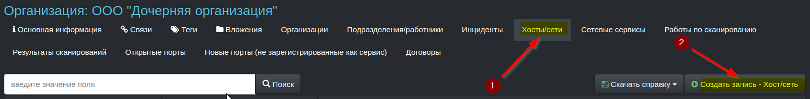
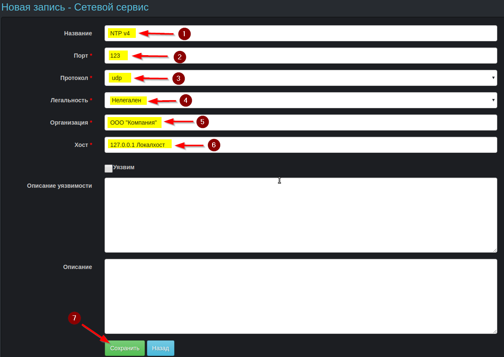

## [Контроль периметра (сетевое сканирование)](./rism/scan/index.md)
##### [RISM](../index.md)
##### [Главная страница](../../index.md)
### Проведение сканирований
Модуль предназначен для сканирования сетевых портов и позволяет контролировать защищенность сетевого периметра организации (или нескольких организаций в холдинговой структуре) на наличие несанкционировано открытых портов.

Для организации такого контроля в приложении создаются работы по сканированию, для которых определяется расписание их периодического выполнения.

Регулярно наблюдая результаты сканирования можно проверять, что в Интернете не появились доступные ресурсы организации (порты сетевых служб) которых там не должно быть (нелегитимные порты/сервисы).
#### Создание опций сканирования
Перед созданием работ по сканированию необходимо создать **опции сканирования** - параметры, которые определяют какие порты проверять, с какой интенсивность это необходимо делать и какую дополнительную информацию требуется получить.

Одна опция сканирования может быть использована в разных работах по сканированию.

Параметры сканирования соответствуют опциям программы **nmap**.
#### Создание хоста
Рекомендуется создать (в организации или организациях) записи хостов, которые планируется сканировать (цели сканирования).

После создания работ эти хосты можно будет добавить в качестве целей для сканирования (закладка **хосты** в карточке работы по сканированию), хотя задать цели сканирования можно и при создании (редактировании работы) в соответствующем поле работы (не рекомендуется, так как для отслеживания легитимности открытых портов все равно придется создавать сервис, а для этого потребуется создать хост).

#### Создание работы по сканированию

#### Добавление в работу хостов - целей сканирования

#### Создание расписания сканирования

Создание хостов, работ по сканированию, сервисов, а также просмотр результатов сканирования можно выполнять как из карточки организации, так и из соответствующих модулей (в этом случае работа будет вестись с объектами всех доступных пользователю организаций).

#### Запуск внеплановой работы по сканированию

Также имеется возможность запустить все внеплановые работы из меню **команд**

### Анализ результатов сканирования
Информация о статусе работы по сканированию можно просмотреть на закладке **История работ по сканированию**.

Результаты работы отображаются в соответствующей закладке карточки организации (будут показаны только те результаты, целью которых являются хосты, принадлежащие организации), а также в общем списке результатов работ (отображаются только те результаты, которые относятся к работам организаций доступных для пользователя).

Полная информация о результате сканирования доступна при нажатии на конкретную запись из списка результатов сканирований (в полях времени, параметров и статуса портов, информации сервисе и продукте).

Если работа завершена, то можно отфильтровать и просмотреть все ее результаты, перейдя по соответствующей ссылке  **ID фоновой работы**.

Если работа находится в процессе ее выполнения, то администратор системы может просмотреть статус работы в системе фоновых задач приложения - **Sidekiq**.

При переходе по ссылкам закладок/таблиц **открытые порты**, **новые сервисы** отображаются только те результаты работ, которые получены в ходе последней выполненной работы.

> Например, если первый раз работа выполнялась вчера и был найден открытый 22 порт TCP, а второй раз работа была выполнена сегодня и этот порт не попал в ее результаты как открытый (даже если не проверялся в последней работе), то в открытых портах и в новых сервисах этот порт не будет отображен.

### Поиск и фильтрация
В таблицах **результаты сканирований**, **новые сервисы** и **открытые порты** доступны функции простого поиск по ключевым словам

В таблице **результаты сканирований** доступен расширенный поиск по нескольким полям

### Отслеживание легитимности портов
Для контроля того, что не появляется новые нелегитимные порты целесообразно по результатам первых сканирований завести соответствующие сервисы, относящиеся к хостам организаций, пометить их легитимность и в дальнейшем отслеживать появление новых сервисов.
Создать новый сервис можно как из списка результатов сканирования, так и из меню соответствующей таблицы.

Из списка результатов сканирования, помимо новых, сервисов можно создавать хосты и получать информацию от сервиса shodan.

Также можно скачивать справки о хостах и сервисах организаций, результатах сканирований можно скачивать из приложения по соответствующим ссылкам.

