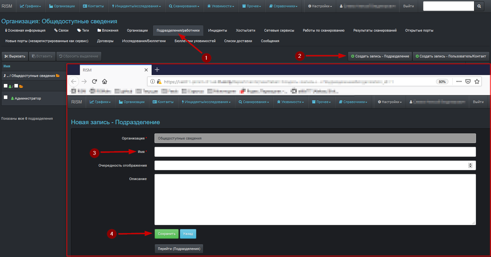

##### [Главная страница](../../index.md)
##### [RISM](../index.md)
## Инструкция по созданию пользователя RISM и наделению его полномочиями доступа
Далее описана последовательность действий по созданию пользователя системы.
#### Добавление организации

Данный этап не выполняется, если пользователь создается в уже существующей организации
#### Добавление подразделения

Данный этап не выполняется, если пользователь создается в уже существующем подразделении
#### Добавление пользователя

Требования к паролю в системе:
* минимальная длина – 8 символов
* должна быть минимум одна буква в нижнем регистре
* должна быть минимум одна буква в верхнем регистре
* должна быть минимум одна цифра
* должен быть минимум один спецсимвол (*, !, @ и т.п.)

Для генерации первоначального пароля пользователя (этот пароль должен быть им сменён после первого входа) можно воспользоваться генератором паролей, например, на данной странице

#### Добавление ролей
Данный этап не выполняется, если пользователю назначается уже существующая роль, которая наделена необходимыми полномочиями

#### Наделение ролей полномочиями доступа

#### Назначение пользователю существующих ролей

