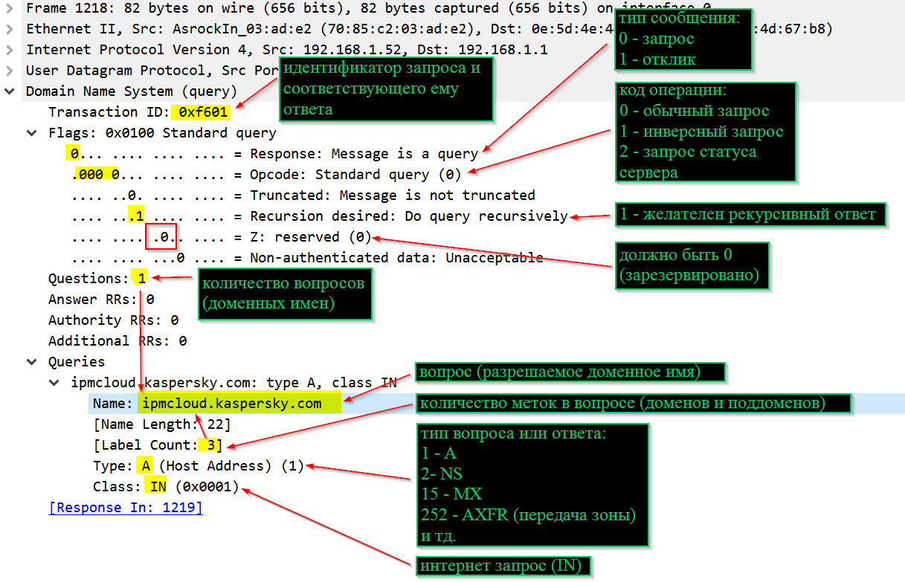
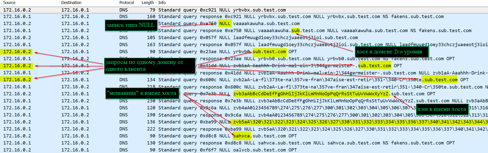
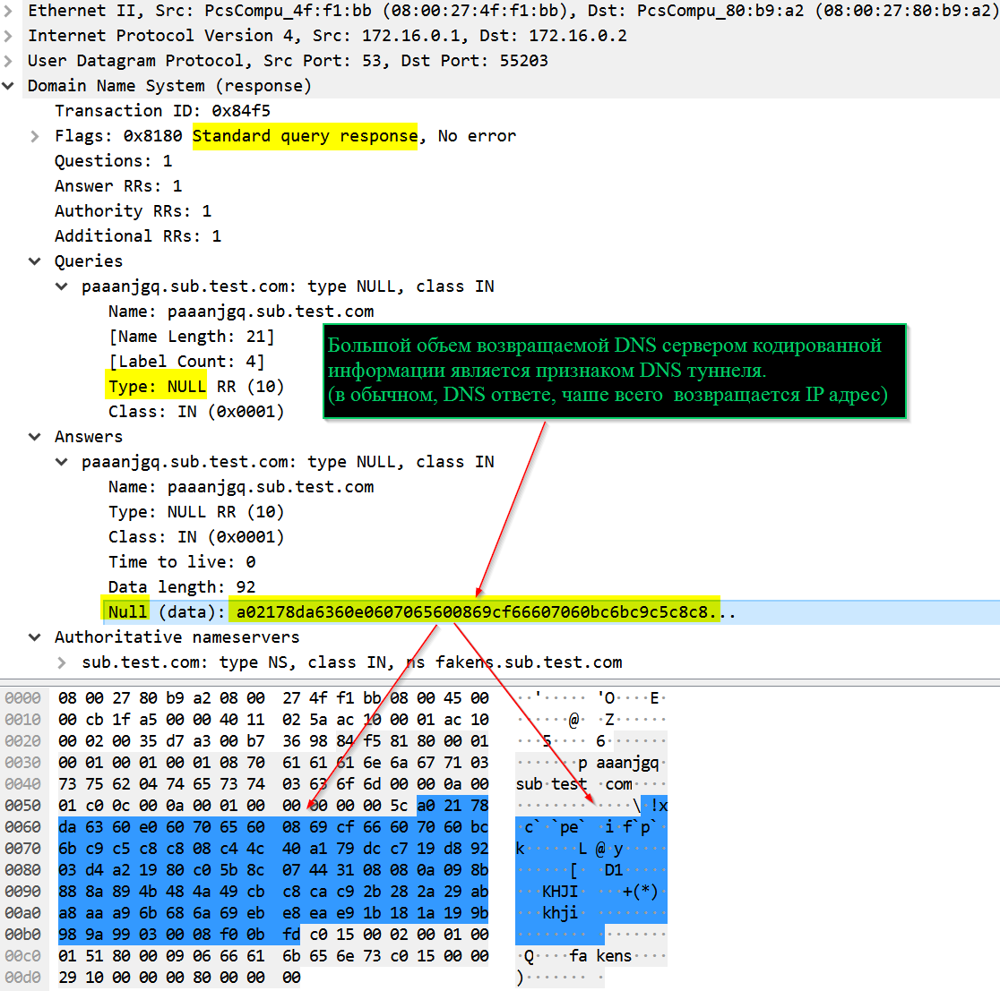
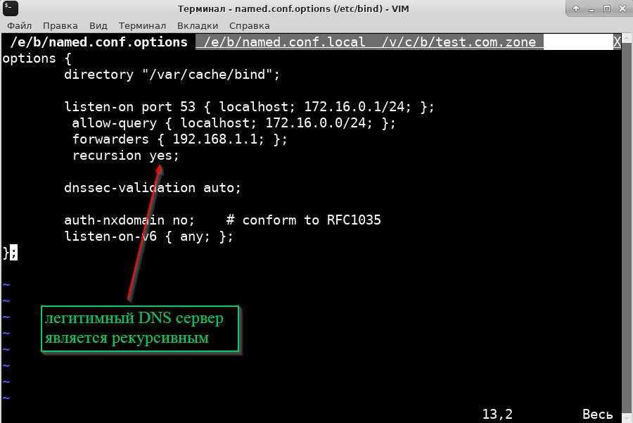
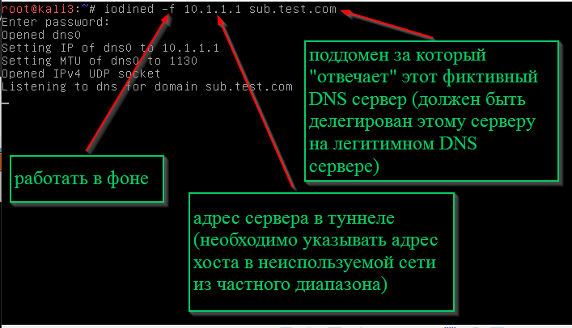
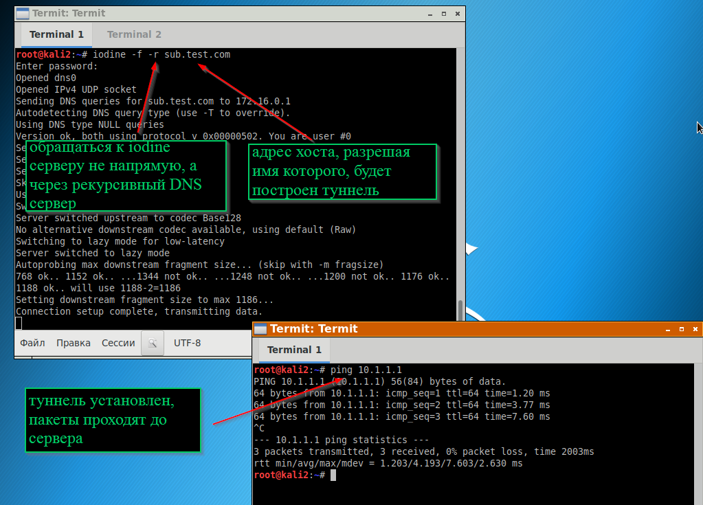
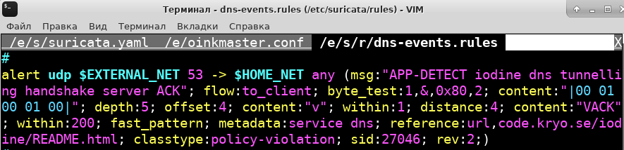
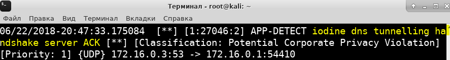

## Выявление туннелей в DNS трафике
### Причины аномалий в трафике, вызванном DNS туннелем
В DNS пакетах обычно не передается много информации - чаше всего в запросе содержится доменное имя хоста, а в ответе его адрес (тип запроса A).
DNS туннель напротив, предполагает передачу большего объема информации.
При этом не все секции (поля) DNS пакета способны вместить передаваемую в туннеле информацию.
Поэтому в туннеле для передачи информации от клиента к серверу используется поле DNS вопроса (там, где обычно указывается доменное имя), а для передачи информации от сервера к клиенту задействуются поля пакета DSN ответа, позволяющие разместить необходимый объем данных (например, TXT, NULL)

В обычном dns трафике происходит обмен текстовой информацией (например, передаются доменные имена и соответствующие им IP адреса).
В случае инкапсуляции в тоннеле сетевых протоколов (например, TCP/IP) в пакетах DNS требуется передавать двоичные данные. А если тоннель передает текстовую информацию (например, команды C&C), то чтобы скрыть очевидность нестандартного содержимого DNS пакетов, текстовые данные превращаются в "мешанину".
Решить обе этих задачи позволяет кодирование передаваемой в туннеле информации, для этого может использоваться семейство котировок BASE (преобразование двоичной информации в набор символов ASCII, таким способом в сообщениях электронной почты передаются файлы вложений).

Обычно трафик DNS проходит через легитимные рекурсивные DNS серверы (например, серверы провайдера и компании), которые кэшируют ответы (при повторном запросе клиента они вернут предыдущий ответ из кэша). То есть организовать канал передачи информации от сервера клиенту (туннель) в таком случае не получится, так как все порции данных, возвращаемые кэширующим сервером, будут одинаковыми, до тех пор, пока не истечет время хранения DNS ответов в кэше (TTL).
Для обхода этого препятствия при построении туннеля устанавливается маленькое значение TTL, и (или) в каждом запросе клиента указывается новое имя хоста (домена), имя которого разрешается DNS сервером.

Обычно в организациях внутренние узлы не могут установить соединение с любым хостом в Интернете (этому препятствуют межсетевые экраны, организация доступа к сайтам через прокси).
При этом DNS запросы от клиентов, как минимум разрешены к DNS серверу организации, который в свою очередь может взаимодействовать с серверами DNS в Интернете.
Что бы Интернет DNS серверы взаимодействовали с сервером DNS туннеля, на них должны быть записи, говорящие о том, что этот сервер отвечает за определенную зону.
Таким образом злоумышленнику необходимо легально приобрести домен (второго и выше уровней, так как это проще и дешевле), а затем указать, что для него разрешать имена уполномочен сервер DNS туннеля.

> Дополнительную информацию можно посмотреть в руководстве по детектированию DNS туннелей от [SANS](https://www.sans.org/reading-room/whitepapers/dns/detecting-dns-tunneling-34152)

### Аномалии в DNS трафике (пакетах), свидетельствующие о признаках туннеля
1. "Мешанина" символов в именах хостов (поддоменов), а также в ответе сервера DNS вместо привычных и читаемых названий (данные в кодировках BASE32, BASE64, BASE128, хэши MD5, SHA1, SHA256 и т.п.).
2. В домене сотни хостов (DNS клиент запрашивает у DNS сервера множество разных имен, относящихся к одному домену).
3. Использование необычных или редких типов запросов, ответ в которых может уместить большое количество информации (NULL, TXT).
4. С одного клиента происходит большое количество DNS запросов по домену.
5. В ответах от DNS сервера разным поддоменам соответствует один IP-адрес.
6. Размер ответа DNS сервера большой (может быть установлена опция truncated в DNS пакете).
7. Частный адрес в ответе DNS сервера.
8. Хосты в доменах выше первого (например, host.sub.com).

### Примеры пакетов UDP с обычным DNS трафиком
##### Обычный DNS запрос

##### Обычный DNS ответ

> Спецификация DNS определена в [RFC 1035](https://www.ietf.org/rfc/rfc1035.txt)

### Примеры пакетов UDP с аномальным DNS трафиком
##### Трафик DNS туннеля (на примере программы для построения туннелей **[iodine](https://github.com/yarrick/iodine)**)

##### Признаки туннеля в DNS запросе при инициации туннеля

##### Признаки туннеля в DNS запросе при передаче данных

##### Признаки туннеля в DNS ответе при передаче данных

### Установление DNS туннеля с помощью iodine
#### Делегирование обслуживания поддомена туннеля фиктивному DNS серверу (на примере конфигурации BIND9)
Файл **named.conf.options**:

Файл **named.conf.local**:

Файл зоны:

Запуск сервера:

Запуск клиента:

Правило Snort для обнаружения туннеля iodine

Сообщение suricata об обнаружении установления соединения iodine

