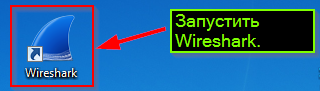
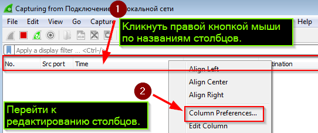
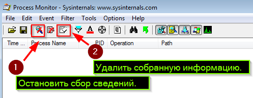
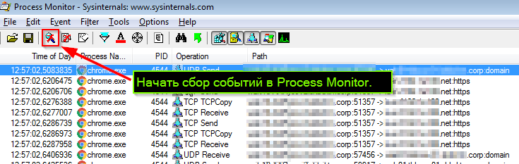

##### [Информационная безопасность](../index.md)
##### [Главная страница](../../index.md)
## Выявление источника сетевого трафика на Windows компьютере
### Подготовка к сбору и анализу информации
#### Скачать и установить утилиту анализа сетевого трафика (снифер)
 [Wireshark](https://www.wireshark.org)
#### Запустить Wireshark

#### Выбрать сетевой интерфейс трафик на котором будет собираться с помощью Wireshark

#### Настроить Wireshark для отображения поля со значением порта источника сетевых пакетов


#### Скачать и разархивировать пакет утилит для анализа Windows
[Sysinternals Suite](https://docs.microsoft.com/en-us/sysinternals/downloads/sysinternals-suite)
#### Запустить утилиту записи и анализа системных событий Windows - Process Monitor

#### Остановить сбор событий в Process Monitor, удалить собранные события

#### Настроить фильтр Process Monitor для сбора системных событий, связанных с отправкой UDP и TCP пакетов


#### Проверить, что фильтруемые Process Monitor события, не будут сохраняться.

> В случае, если осуществляется поиск источника DNS запросов, с большой долей вероятности будет обнаружено, что таким источником является процесс **svchost.exe** - служба MS Windows "DNS клиент".
Что бы определить какое именно приложение "попросило" эту службу разрешить DNS службу необходимо остановить перед началом сбора трафика и системных событий.

#### Задать в Wireshark тип фильтруемого трафика

### Сбор информации
#### Начать захват трафика

#### Начать сбор событий в Process Monitor трафика

#### Завершить захват трафика и событий

#### Сохранить собранный трафик и события


### Анализ собранных данных
#### Найти пакеты анализируемого трафика

#### Определить порт, используемый приложением, которое является источником трафика

и по номеру клиентского порта найти название и идентификатор процесса, посылающего пакеты на сервер
### Дополнительные утилиты
#### Информация об используемых (в настоящее время) в Windows сетевых портах и открывших их процессах
> Консоль CMD необходимо запускать от имени администратора
```cmd
netstat -anbo
```
#### Сбор информации за определенный период времени (до прерывания работы команды нажатием Ctr + C)
```cmd
>for /l %g in () do @( echo write & netstat -anbo >> result.txt )
```
#### В режиме реального времени сетевые коммуникации компьютера с Windows можно наблюдать с помощью утилиты TCPView
[TCPView](https://technet.microsoft.com/ru-ru/sysinternals/tcpview.aspx)
#### Информацию об открытых процессом Windows сетевых портах можно получить (в реальном времени) с помощью утилиты Process Explorer
[Process Explorer](https://technet.microsoft.com/ru-ru/sysinternals/processexplorer.aspx)
