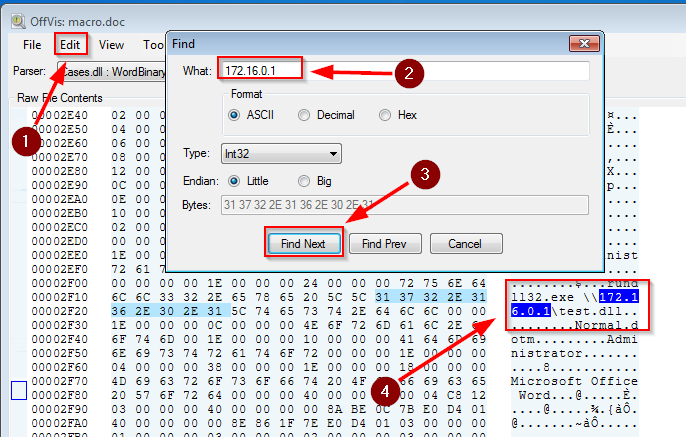
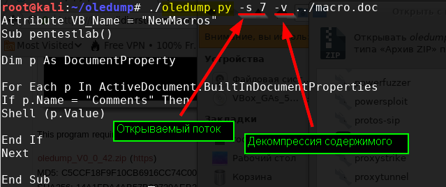
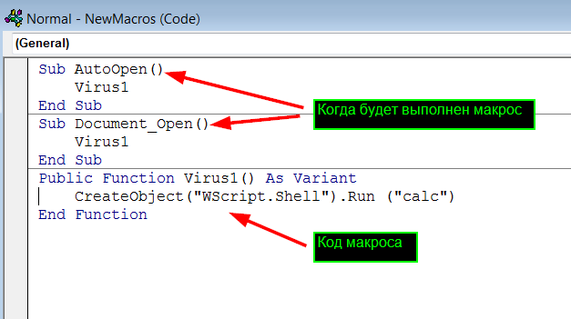

##### [Главная страница](../../index.md)
##### [Информационная безопасность](../index.md)
## Исследование документов MS Office
## Исследование подозрительных документов MS Office
### Общие сведения
#### OLE DDE и COM
OLE (Object Linking and Embedding) - технология связи частей одного документа (или одного документа) с другими (например, диаграммы из Excel вcтравленные в презентацию Power Point будут обновляться при обновлении данных в исходном документе Excel).

OLE1 работала за счет DDE (Dynamic Data Exchange - технология динамического обмена данными).

OLE2 использует COM (объектно-ориентированная компонентная модель).

В свою очередь COM построена на DCR RPC.

DCOM в отличии от COM позволяет обмениваться данными процессами на разных хостах (используя удаленные вызовы RPC).

ActiveX это маркетинговое название для COM компонентов, используемых в веб.

#### CDF
Документы с расширением .doc, .xls, .ppt хранятся в формате CDF (OLE2) - файлы в композитном двоичном формате (то есть для изучения содержимого файлов такого формата требуются специальные утилиты).
#### Структура документа **doc** открытая в утилите **offis**


В данном формате внутри одного файлов скрыто несколько разных потоков данных (CDF файл - это аналог архива, а потоки являются аналогами файлов в этом архиве).

Также внутри потоков могут хранилища (storage) - аналоги папок внутри которых могут находится потоки и другие хранилища.

Макросы (код на VBA) хранятся
* в Word - внутри хранилища Macros
* в Excel - внутри хранилища _VBA_PROJECT_CUR
* в PowerPoint - внутри двоичной структуры презентации

Код макросов хранится в сжатом виде.

Для изучения двоичных офисных файлов MS можно использовать утилиты
* [oledump.py]( https://blog.didierstevens.com/programs/oledump-py/)
* [offvis](https://www.google.com/url?sa=t&rct=j&q=&esrc=s&source=web&cd=1&ved=2ahUKEwjJlITsrpXhAhUF06YKHbIWAZQQFjAAegQIAhAB&url=https%3A%2F%2Fgo.microsoft.com%2Ffwlink%2F%3FLinkId%3D158791&usg=AOvVaw0gVChgHz7_0-0CC-Py6UFS)
#### Просмотр содержимо CDF (OLE) файла и поиск в нем строк (с помощью утилиты offvis)



Документы с расширением .docx, .xlsx, .pptx хранятся в виде нескольких запакованных в один архив XML файлов (то есть их можно легко изучать с помощью текстового редактора).

При этом макросы все равно хранятся в этих архивах в виде двоичных OLE файлов (**vbaProject.bin** - это имя может быть другим), поэтому для их исследования также необходимо использовать специальные утилиты.
### Исследование документов
#### Опции утилиты oledump.py
* -s <номер потока> - вывести содержимое указанного потока
* -v - декомпресовать содержимое потока
* -p <плагин> - использовать плагин
* -D <декодер> - использовать декодер обсфуцированного кода
* -d - дамп (выгрузка) содержимого потока
> Утилита oledump.py может открыть запароленные zip архивы с документами (пароль - infected)
#### Информация о потоках doc файла
```bash
oledump.py файл.doc
```

> В выводе
* символ **m** - сообщает о наличии в потоке VBA кода с атрибутами
* символ **M** - сообщает о наличии в потоке VBA непосредственно макроса
#### Информация о потоке doc файла (без декомпрессии)
```bash
oledump.py -s номер файл.doc
```

#### Информация о потоке doc файла (с декомпрессией)
```bash
oledump.py -s номер -v файл.doc
```

#### Выгрузка (дамп) и декомпрессия содержимого указанного потока в новый файл
```bash
oledump.py -s номер -v файл.doc > файл
```
#### Поиск URL
```bash
oledump.py -p plugin_http_heuristics файл.doc
```
### Исследование RTF
RTF документы не могут содержать макросы, но могут содержать в себе другие (с помощью OEL) файлы.
### Способы обфускации вредоносного кода
#### Замена символов макроса или двоичного кода
Код макроса (VBA) может содержать двоичный код DLL, скрытый путем замены представляющих его текстовых символом (например, методом **Chr(код)**).

После обратного преобразования DLL код сохраняется макросом на диск и передается в качестве параметра на исполнение программе **win32dll.exe**.
#### Скрытие параметров макроса в свойствах документа doc

### Способы внедрение вредоносного кода в MS Word
#### Добавление в документ макросов


#### Добавление в документ вредоносного кода через технологию OLE


#### Вызов внешних программ через поле DDE документа


### Инструменты
* [oledump.py]( https://blog.didierstevens.com/programs/oledump-py/)
* [offvis](https://www.google.com/url?sa=t&rct=j&q=&esrc=s&source=web&cd=1&ved=2ahUKEwjJlITsrpXhAhUF06YKHbIWAZQQFjAAegQIAhAB&url=https%3A%2F%2Fgo.microsoft.com%2Ffwlink%2F%3FLinkId%3D158791&usg=AOvVaw0gVChgHz7_0-0CC-Py6UFS)
### Полезные ссылки
* [www.decalage.info](https://www.decalage.info/en/file_formats_security)
* [www.decalage.info](https://www.decalage.info/vba_tools)
* [oledump.py]( https://blog.didierstevens.com/programs/oledump-py/)
* [youtube](https://www.youtube.com/user/dist67/videos)
