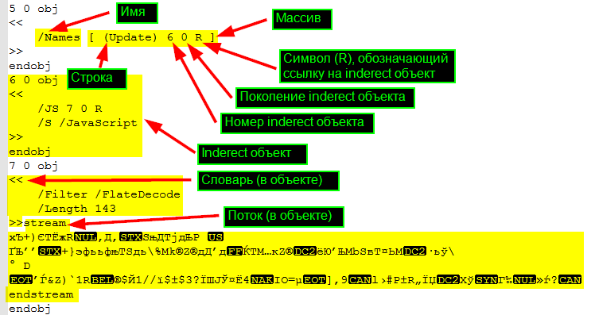
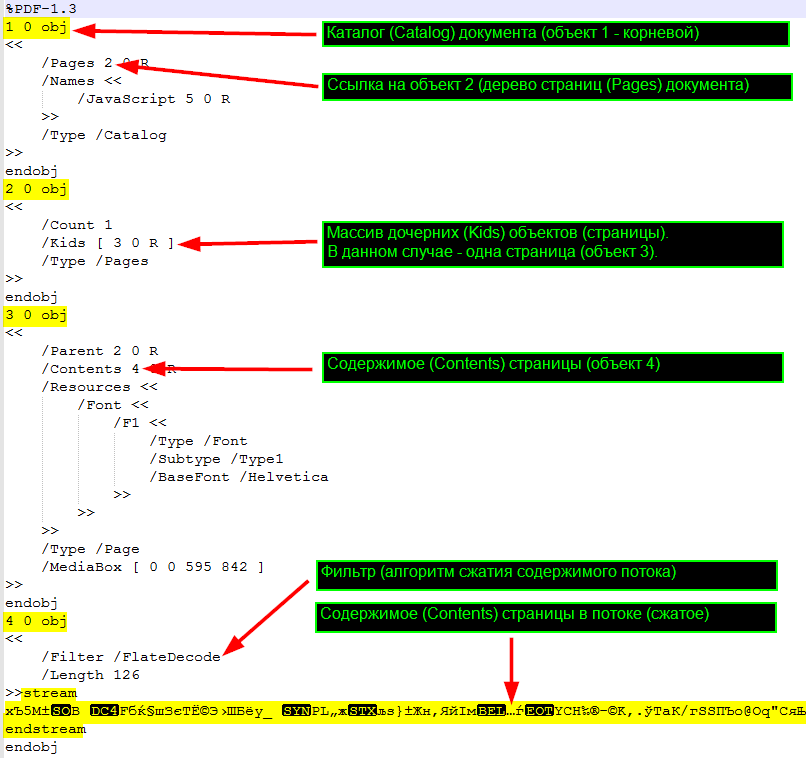
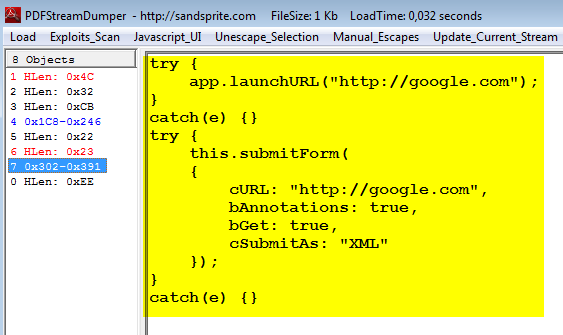
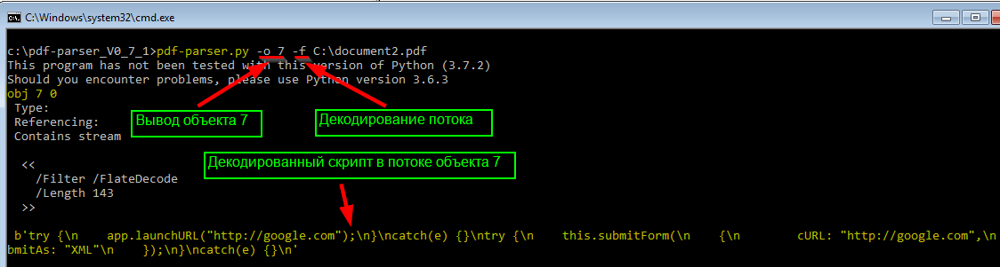
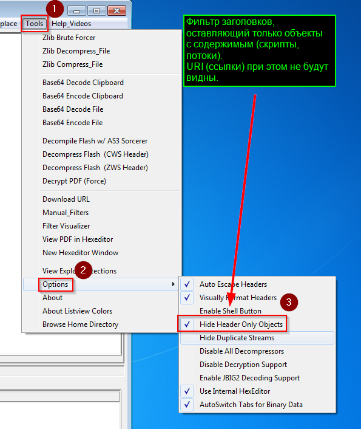

## Исследование PDF документа
### Основные сведения о формате PDF
По сути PDF – это текстовый (ASCII) файл, содержащий дерево объектов.

Каждый объект относится к одному из 8 типов (Boolean, Numbers, Strings и т.п.).

Помимо текстовой информации PDF может содержать и двоичные данные (например, изображения), закодированные текстовыми символами. Такие данные размещаются в потоках (Stream).

Кроме двоичных данных в потоках могут размещаться и другие (текстовые) объекты PDF. Так как информация в потоках может сжиматься и кодироваться это позволяет создавать компактные PDF документы.

Одни объекты могут находится внутри других.
#### Типы PDF документов
PDF документ может быть одного из двух типов
* non-linear (not "optimized")
* linear ("optimized") – первые страницы могут отображать до загрузки всего документа

Непосредственно содержимое документа (отображаемая информация) определяется с помощью команд PostScript (эти команды могут быть, например, внутри потока, связанного со страницей документа).
Типы объектов
#### Строка (также называется именем)
```
/Строка
```
#### Массив
```
[…]
```
#### Словарь» (Dictionaries) может содержать набор ключей-значений, сгруппированных под одним именем.
```
<</ключ значение>>
```

#### Объекты – могут быть
* прямыми (direct) – встроенные в другие объекты
* непрямыми (inderect) – заключенные между конструкцией
```
номер поколение obj
	данные
endobj
```
> Номер поколения (версия объекта, в документе может быть несколько объектов с одинаковым номером, тогда версия определяет какой из них актуальный) в настоящее время не используется (исключено из стандарта, но присутствует в файле из-за обратной совместимости).

Объекты ссылаются друг на друга по этим номерам.
#### Поток (Stream) может содержать двоичные или сжатые (кодированные) данные (в том числе и объекты).
```
obj номер поколение
<<
	информация о потоке
>>stream
endstream
двоичные (кодированные) данные
endobj
```
#### Структура PDF
PDF документ состоит из следующих частей 
* Заголовок (Header) – версия PDF и т.п.
* Тело (Body)
* Таблица перекрестных ссылок (cross-reference) – информация, позволяющая ускорить случайное чтение объектов из тела
* Окончание (Trailer) – информация о расположении таблицы перекрестных ссылок и корневого объекта (Root)

> Символ R после двух чисел (номера объекта и номера поколения) является аналогом слова "obj" (говорит о том, что информация относится к объекту).
### Изучение подозрительных PDF документов
В документе могут содержать (и соответственно их необходимо выявлять) следующие угрозы
* ссылки на скомпрометированные ресурсы
* вредоносные скрипты (JavaScript, Flash)
* shell код (бинарный код, запускающийся при эксплуатации уязвимости программ чтения PDF документа)
### Изучение PDF документа в текстовом редакторе
#### Поиск таблицы перекрестных ссылок
PDF документ можно исследовать в текстовом редакторе (например, в notepad++).

Изучение PDF документа начинается с конца файла, где после строки **startxref** указано смещение от начала файла по которому находится таблица перекрестных ссылок.

Но в текстовом редакторе таблицу проще найти по ключевому слову **xref** с которого она начинается.

Таблица перекрестных ссылок содержит смещение от начала файла для каждого номера непрямого объекта, что позволяет быстро находить объект по его номеру.
```
xref
0 1
0000000000    65635  f
номер количество
смещение      поколение занятость
```
где
* первые (в данном случае их 2) линии – это заголовок xref (первая строка объект с номером 0 и количество объектов для которых ниже задано смещение, вторая строка его само смещение)
* строка с двум цифрами – это номер первого объекта в группе объектов для которых следует ссылка ниже (первая цифра) и количество объектов с последовательной нумерацией для которых в строках ниже задано смещение (вторая цифра)
* строки с тремя символами – это смещения (первое число) для соответствующих номеров (указанных в двухсимвольных строках выше), номер (вторая цифра) поколения и символ (третий символ) занятости (n) и незанятости (f) объекта.


#### Поиск корневого объекта (Root)
Найдя корневой объект можно перемещаться по древовидной структуре объектов (ориентируясь по их номерам и находя в файле объекты по таблице перекрестных ссылок).

Номер корневого объекта (объект типа (Type) Catalog) ищется по слову Root в словаре окончания
```
trailer
<<
/Type /Catalog
/Root номер поколение
>>
startxref
смещение
%%EOF
```
В самом корневом объекте содержится информация о словаре Pages с номерами объектов, являющихся страницами документа (Kids).


> Исследовать PDF удобно в текстовом редакторе, позволяющем переходить к подстроке по смещению от начала файлов (навигация по дереву объектов с помощью информации таблицы перекрестных ссылок).
### Изучение PDF документа с помощью специализированных утилит
#### Информация о содержимом (имеющихся в документе именах) PDF документа (c помощью утилиты [pdfid]( https://blog.didierstevens.com/programs/pdf-tools/))
```cmd
pdfid.py документ.pdf
```

В выводимом результате в первую очередь следует обратить внимание на следующие объекты
* JavaScript – код JavaScript
* JS – код JavaScript
* OpenAction – действие, совершаемое автоматически при открытии документа
* AA– действие, совершаемое автоматически 
* Launch – запуск программы или открытие документа
* Action
* EmbeddedFiles – встроенные в документ файлы
* ObjStm – потоковый объект (может содержать кодированные (скрытые) объекты)
* URI – доступ к ресурсу по URL
* GoTo – переход (при просмотре PDF) внутри документа или внутри другого документа
* SubmitForm /GoToR – передача данных на URL

При этом надо учитывать, что объекты (например, ссылки) могут быть скрыты в потоке ObjStm и что бы их увидеть необходимо использовать опцию **-O** утилиты **pdf-parser.py**.
#### Информация о содержимом (имеющихся в документе именах) PDF документа (c помощью утилиты [pdf-pasrser]( https://blog.didierstevens.com/programs/pdf-tools/))
```cmd
pdf-pasrser.py -a -O документ.pdf
```
> в выводе результата последняя цифра – это номер объекта

Опции pdf-pasrser.py
* -a – показать статистику
* -O – декомпрессировать и «распарсить» объекты
* -f – применить фильтр, применяемый для кодирования (сжатия) в потоке и вывести декодированный результат
* -s слово – поиск объектов, содержащих ключевое слово (например, искомое слово js для поиска /JS)
* -k – поиск значений по ключу внутри словарей (например, **-k /URI** покажет значение для /URI). Эту опцию можно комбинировать с **-O.**
#### Информация о содержимом (имеющихся в документе именах) PDF документа (c помощью утилиты [PDF Stream Dumper](http://sandsprite.com/blogs/index.php?uid=7&pid=57))

#### Поиск имен (строк) в документе, например, таких как JavaScript, OpenAction, URI и т.п. (c помощью утилиты pdf-pasrser) 
```cmd
pdf-pasrser.py -s строка -O документ.pdf
```
Например, для поиска OpenAction в myfile.pdf
```cmd
pdf-pasrser.py -s openaction -o номер -O myfile.pdf
```

#### Поиск имен (строк) в документе (c помощью утилиты [pdfwalker gem]( https://github.com/gdelugre/pdfwalker))


#### Поиск примечательных объектов (или строк) в документе (c помощью утилиты PDF Stream Dumper)



#### Посмотреть конкретный объект, декодировав поток (c помощью утилиты pdf-pasrser)
```cmd
pdf-pasrser.py -o номер -f документ.pdf
```

#### Посмотреть конкретный объект (c помощью утилиты pdfwalker)


#### Посмотреть конкретный объект (c помощью утилиты PDF Stream Dumper)


### Способы обфускации
В PDF документе может применяться обфускация имен объектов, за счет замены символов их цифровыми кодами (#код).

pdfid.py сообщает о наличии таких объектов помещением их количества в скобки.

Другой метод обфускации – помещение объектов (например, JavaScript) в объект Stream и сжатие (кодирование) данных (Filter).

pdfid.py не покажет наличие объектов скрытых в Stream.

Что бы увидеть наличие таких объектов необходимо использовать pdf-parse.py с опциями  a (статистика, аналогичная в pdfif.py) и -O (декодировать Stream).
### Работа с [PDF Stream Dumper](http://sandsprite.com/blogs/index.php?uid=7&pid=57)
#### Цветовая легенда заголовков (объекты в крайней левой панели)


#### Скрытие объектов (заголовков), не имеющих содержимого (потоков, JavaScript и т.п.)

### Наиболее примечательные имена объектов
#### Фильтр сжимающий данные
/Filter
#### Параметры сжатия (для Filter)
/DecodeParams
#### Страница документа
/Page
#### Содержимое страницы (Page)
/Contents
#### Фильтр (Filter) сжатия
/FlateDecode
#### Фильтр кодирования из HEX в ASCII
/ASCIIHexDecode

### Инструментарий для изучения документов PDF
* [pdfid.py]( https://blog.didierstevens.com/programs/pdf-tools/)
* [pdf-parser.py]( https://blog.didierstevens.com/programs/pdf-tools/)
* [pdfwalker gem]( https://github.com/gdelugre/pdfwalker)
* [PDF Stream Dumper](http://sandsprite.com/blogs/index.php?uid=7&pid=57)

### Полезные ссылки
* [blog.idrsolutions.com](https://blog.idrsolutions.com/2013/01/understanding-the-pdf-file-format-overview/#pdf-format)
* [www.youtube.com](https://www.youtube.com/user/dist67/videos)
