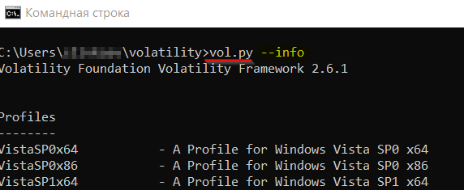
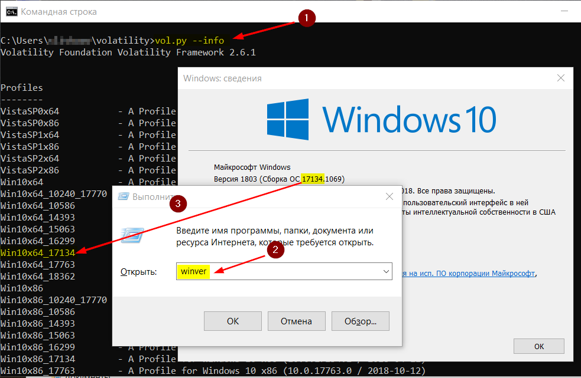
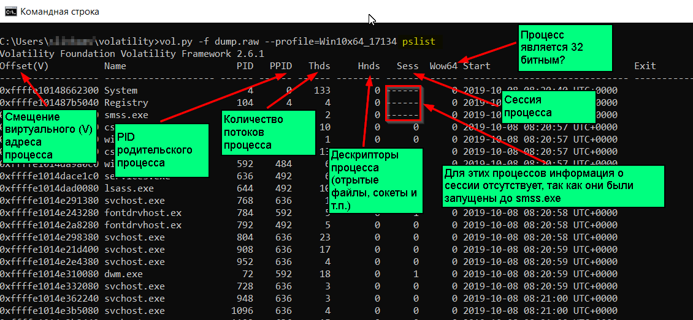
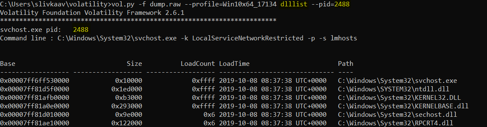

##### [Главная страница](../../index.md)
##### [Информационная безопасность](../index.md)
## Исследование памяти с помощью volatility framework
### Общие сведения о памяти Windows
Windows, в основном, написана на языке программирования С.

В данном языке (соответственно и в памяти Windows) имеется такой тип данных как структура (тип данных, объединяющий несколько полей определённого типа (integer, boolean и т.п.). 
Из структур создаются конкретные объекты (в  т.ч. процессы, дескрипторы файлов, сокеты и т.п.).

Таким образом задача исследования дампа памяти Windows сводится к поиску указанных выше структур и изучению их свойств (например, таких свойств как название запущенного процесса, время его запуска и т.п.).

Структура _KPRCB (Processor Region Control Block) содержит адреса текущего активного потока, следующего запланированного потока и простаивающего потока. Виртуальной адрес этой структуры в ОС известен.

Каждый поток представлен объектом структуры _ETHREAD, который в свою очередь содержит объект структуры _KTHREAD.

_KTHREAD содержит ссылку на процесс (объект структуры _EPROCESS), к которому относится этот поток.

Как сказано выше каждый процесс представлен объектом структуры _EPROCESS.

> Структуры _EPROCESS хранятся в невыгружаемом пуле памяти.

В каждом объекте структуры _EPROCESS имеется поле ActiveProcessLinks с указателем на структуру _LIST_ENTRY из двух элементов с ссылками на предыдущий и следующий процессы (предыдущий _EPROCESS и следующий _EPROCESS).

То есть последовательность _EPROCESS образуют двусвязный список.

Ссылка на первый (головной) элемент двусвязного списка (это первый процесс – system) содержится в символе (переменной) PsActiveProcessHead.
> Символы (символы отладки) это текстовое обозначение (облегчает читаемость отладочной информации) адресов входов функций, переменных и т.п.

Информация о PsActiveProcessHead содержится в KDBG – структуре ядра Windows с отладочной информацией.

Каждый процесс имеет:
* один или более потоков
* дескрипторы файлов
* дескрипторы сокетов
* список загруженных DLL
* изолированное приватное пространство памяти – собственный стек и кучу (HEAP), специфичную для процесса память с данными.

#### Артефакты (структуры в памяти), связанные с процессами
* _ETHREAD - каждый процесс имеет минимум 1 поток. Таким образом через перечень всех потоков (объект _ETHREAD) можно выйти на все процeссы.

* CSRSS - так как CSRSS создаёт все процессы и потоки (кроме себя самого и запущенного до него) в его памяти имеется информация о них.

* PspCid - в таблице ядра PspCid (отладочная информация) содержатся ссылки на все процессы и потоки

* SessionProcessLinks  - процессы пользовательской сессии

* tagDesktop - процессы рабочего стола

#### Методы поиска объектов в памяти
В общем поиск каких либо объектов в памяти (процессов и т.п.) можно выполнить следующими способами:
* поиск структур, по ссылкам опираясь на структуры памяти в которых есть информация о размещении структур запущенных процессов. Так, например, работает плагин pslist, которые находит двусвязный список всех запущенных процессов и перемещаясь по нему получает информацию о каждом из них.
* последовательный перебор всех данных в дампе и поиск последовательностей данных, совпадающих с известными потернами структур (например, процессов). Плагины volatility реализующие данный метод содержат в своем названии слово **scan** (например, psscan). Преимущества данного метода:
- могут быть найдены структуры, которые злоумышленник специально скрыл (например, поменял ссылки в двусвязном списке процессов)
- могут быть найдены остатки прекративших своё существование структур (например, информация об уже завершенных процессах)
- могут быть ложные срабатывания, старые данные найденных в освобожденных участках памяти структур могут быть частично затерты.

### Общие сведения о volatility
Volatility может работать с:
* дампом памяти;
* crash дампом (создается при возникновении «синего экрана» Windows);
* страничным файлом;
* снимком виртуальной машины или приостановленной виртуальной машины - .vmem, .vmsn, .vmss (снимок);
* hibernate дампом (hiberfile.sys).

Функциональность volatility строится на плагинах – по это сути команды, которые позволяют получить из дампа те или иные сведения (в составе volatility таких плагинов около 200).

### Основные понятия
* VType язык - это язык описания типов данных различных ОС в volatility.
* Overlay - созданные пользователем volatility замены для автоматически сгенерированных описаний VType, которые и помогают указать тип для члена структуры тип которого в VType не определен.
* Класс - класс volatility, описывающий структуру данных ОС, может быть дополнен пользовательскими методами.
* Экземпляр - конкретный экземпляр класса объекта volatility.
* Профиль - совокупность VType, Overlay и Классов, описывающих конкретную версию ОС. Кроме прочей информации профиль также включает в себя индексы и имена системных вызовов ОС.

### Установка volatility на Windows
Если, к примеру, установить т.н. Windows Standalone Executable пакет volatility, например с сайта [volatility](https://www.volatilityfoundation.org/releases) или через менеджер пакетов [chocolatey]( https://chocolatey.org), то в такой версии volatility может не оказаться профилей с последними версиями Windows.

Поэтому лучше выполнить установку следующим образом. 
#### Установить python 2.7
Установить python можно через [chocolatey](https://chocolatey.org/packages?q=powershell) или через [обычный инсталлятор](https://www.python.org/downloads/windows/).
#### Установить зависимости
* Distorm
В папке [релизы](https://github.com/gdabah/distorm/releases) необходимо найти полсденю версию для python 2.7 по ссылке **Python 2/3**. Например для версии 3.3.4 [distorm3-3.3.4.win-amd64.exe](https://github.com/gdabah/distorm/releases/tag/v3.3.4).
* PyCrypto
С этой [страницы](http://www.voidspace.org.uk/python/modules.shtml#pycrypto) необходимо скачать файл PyCrypto 2.6 for Python 2.7 64bit.
* openpyxl
```cmd
pip install openpyxl
```
* ujson 
```cmd
pip install ujson 
```
* yara
Скачать и установить последнюю версию yara для python 2.7 согласно инструкции на [странице](https://dfironthemountain.wordpress.com/2018/10/29/installing-volatility-on-windows/).

#### Установить последнюю версию volatility
```cmd
git clone https://github.com/volatilityfoundation/volatility.git
cd volatility
```
На этом установка закончена и перейдя в папку с volatility можно запускать этот фреймворк скриптом **vol.py**.

### Создание дампа памяти для исследования с помощью volatility
#### Dumpit
Дамп проще всего создать с помощью программы **dumpit** из пакета **Comae-Toolkit**.
Скачать этот пакет можно с следующей страницы [comae](https://my.comae.com/login)(требуется регистрация).

Для создания дампа памяти достаточно запустить файл dumpite.exe.

Дамп сохранится в текущей директории.
> На диске должно быть столько свободного места, какой размер ОЗУ.

Для указания профиля ОС в volatility, нужно узнать версию исследуемой ОС и ее билд.
```cmd
winver
```
Эту информацию можно записать в имени файла дампа.
#### Удаленный дамп с помощью dumpite
Запуск сервера
```cmd
dumpite.exe /l /f дамп.raw
```
Передача данных на сервер
```cmd
dumpit.exe /t сервер /s 1 /rc4 ключ
```
> Опция **сервер** это IP-адрес сервера

Дешифровка дампа на сервере
```cmd
dumpit.exe  /rc4 ключ /unpack зашифрованный.raw расшифрованный.raw
```
#### Winpmem Opensource утилита для снятия дампа (часть проекта rekall) [winpmem](https://github.com/Velocidex/c-aff4/releases)
**Winpmem** сохраняет несколько потоков информации в контейнере (формат AFF4 - архив файлов (может быть сжатым или нет), данный формат читается с помощью **recall**).

В этих потоках, помимо дампа всей памяти, имеется метаинформация, данные отдельных драйверов и т.п. Соответственно с дампом памяти в контейнере winpmem volatility (который, как сказано выше, содержит не только дамп памяти) напрямую не может работать.

Что бы volatility прочитал дамп, созданный winpmem нужно сохранить результат работы данной утилиты в «сыром» (raw) формате и указать папку в которую производится сохранение:
```cmd
winpmem --format raw  -o папка\
```
или
```cmd
winpmem --format raw  -o фай.zip
```
> Если первым способом дамп не удастся получить, то можно использовать вторую команду. Для использования, созданного указанной выше (второй) командой, дампа его надо будет разархивировать и в открытом архиве найти самый большой файл – собственно это и будет нужный нам дамп.

Для тех утилит анализа дампа, которые могут напрямую работать с форматом AFF4 дамп памяти можно создать так
```cmd
winpmem_1.3.exe -o дамп.raw
```

### Подбор профиля ОС для volatility
Перед началом исследования дампа памяти в volatility, нужно подобрать подходящий профиль операционной системы.

Перечень поддерживаемых volatility профилей
```cmd
python.exe vol.py --info
```

> Профиль - это запись вида **Win10x64_17763**.

В списке необходимо найти подходящий профиль и проверить что он работает.
Самый простой способ проверки выполнить команду
```cmd
python.exe vol.py -f дамп.dmp --profile=профиль pstree
```
#### Узнать из дампа какой профиль необходимо использовать (работает очень медленно)
На запущенной исследуемой машине

По метаинформации о дампе памяти
```cmd
python.exe vol.py -f дамп --imageinfo
```
По информации отладчика в ядре (работает очень медленно)
```cmd
python.exe vol.py -f дамп --kdbgscan
```
В крайнем случае можно перебирать разные профили, пока не найдется подходящий и в выводе плагина pstree (команда выше) не будут отображаться корректные названия процессов.
### Исследование вредоносного кода с помощью volatility
В общем случае с помощью volatility следует выполнить:
* получить перечень процессов
* получить перечень сервисов
* получить перечень сетевых соединений
* получить перечень последних консольных команд
* найти вредоносный код, выгрузить его на диск и исследовать, в том числе в песочнице

#### Подсказка по командам (плагинам) доступна следующим образом
```cmd
python.exe vol.py -h
```
#### Справка по опциям плагина
```cmd
python.exe vol.py плагин --help
```
#### Сохранение результата в файле
```cmd
python.exe vol.py -f дамп --profile=профиль плагин > файл
```
или (может вывести результат не только в текстовом формате)
```cmd
python.exe vol.py -f дамп --profile=профиль плагин --output-file=файл
```

## Анализ процессов в дампе
### Методика исследования процессов
1. Необходимо исключить из рассмотрения известные легитимные [процессы] (https://securitybytes.io/blue-team-fundamentals-part-two-windows-processes-759fe15965e2).

При этом надо учитывать возможность маскировки нелегитимных процессов под легитимные.

Для этого надо знать названия таких процессов, стандартное расположение их исполняемых файлов, порядок запуска этих процессов при старте ОС, и кто из них для кого является родителем/потомком.
2. Необходим просмотреть на места расположения файлов программ, которые породили процессы.
3. Надо обращать внимание на процессы, которых не должно быть, например, на процессы с расширениями отличными от **.exe**.

#### Перечень основных (критичных) процессов ОС Windows
* **Idle** – не имеет исполняемого файла на диске, служит контейнером для простаивающих потоков
* **system** (pid 4)
- служит контейнером для потоков уровня ядра
- может быть владельцем дескрипторов файлов и сокетов, открытых ядром
- не имеет исполняемого файла на диске
* **csrss.exe** – **c**lient **s**erver **r**untime **s**ystem,
- создает другие процессы и потоки в Windows (соответственно, поддерживает список всех запущенных процессов и потоков)
- до Windows 7 являлся брокером всех команд, запущенных в консоли (**CMD**)
- размещается в system32
- на каждую сессию создается один экземпляр этого процесса
* **conhost.exe**
- с Windows 7 являлся брокером всех команд, запущенных в консоли (**CMD**)
* **services.exe** 
- управляет сервисами (соответственно, поддерживает список всех запущенных сервисов)
- является родителем для svchost.exe, а также сервисов spoolsv.exe и SearchIndexer.exe
- создаётся только один экземпляр этого процесса
- размещается в system32
* ** svchost.exe **
- контейнер для DLL библиотек, реализующих сервисы (один такой процесс может быть контейнером для нескольких DLL)
- может быть много экземпляров этого процесса
- должен иметь опцию **-k**
- размещается в system32
* **lsass.exe**, **l**ocal **s**ecurity **a**uthority **s**ubsystem
- применяет политики безопасности, делает проверку паролей и создаёт токены доступа
- в памяти этого процесса в отрытом виде могут содержаться жэши паролей
- является потомком либо **winlogon.exe** (до Windows Vista) либо **wininit.exe** (начиная с Windows Vista)
- создаётся только один экземпляр этого процесса
- размещается в system32
* **winlogon,exe**
- отвечает за интерактивнй вход пользователя, перехват Ctrl + Alt + del, инициирует хранитель экрана
- создаётся только один экземпляр этого процесса
- размещается в system32
* **explorer.exe**
- отвечает за GUI пользователя (навигация в файловом менеджере и т.п.)
- один экземпляр на каждую пользовательскую сессию
* **smss.exe**
- менеджер сессий
- первый процесс, стартующий в пользовательском режиме

### Плагины для анализа процессов
#### pslist
Перечень процессов извлекается из двусвязного списка на первый элемент которого указывает символ PsActiveProcessHead.

Этот плагин не позволяют обнаружить завершённые и скрытые процессы (скрытые с помощью техники direct kernel object manipulation - DKOM) так как производят поиск в двусвязном списке процессов.

В выводе pslist Offset (V) это смещение виртуального (V) адрес объекта (структуры) _EPROCESS ядра.

Это смещение необходимо для указания в качестве параметра некоторых других плагинов volatility (когда такой плагин должен выдавать информацию о конкретном процессе).
:
> Начиная с Windows XP и 2003 сессия 0 изолирована от пользовательских сессий (то есть в современных ОС всегда будет 0 сессия и по сессии на каждого работающего в системе пользователя)

```cmd
python vol.py -f дамп --profile=профиль pslist
```

#### pstree
Аналогичен pslist, но графически (отступами и точками) отображает связь родительских 
#### psscan
Сканирует дамп и ищет в ней объекты_EPROCESS (может выявить скрытые процессы).
```cmd
python vol.py -f дамп --profile=профиль psscan
```
#### Графическое представление дерева процессов 
```cmd
python vol.py -f дамп --profile=профиль --output=dot --output-file=результат.dot
```
Просмотреть вывод в формате .dot можно с помощью программы **Graphviz**.
#### Сравнение информации о процессах в различных плагинах
Плагин **psxview** позволяет сопоставить результаты работы плагинов, показывающих информацию о процессах.

Опция **--apply-rules** выводит Ok если отсутствие процесс не найденного каким-либо плагином является нормальным в силу особенностей данного процесса (например, если он и не должен присутствовать в структуре, которую исследует)
#### Список загруженных процессом DLL
Этот плагин получает список DLL из двусвязанного списка (структура _LDR_DATA_TABLE_ENTRY) на который указывает InLoadOrderModuleList из PEB.
``cmd
python vol.py -f дамп --profile=профиль dlllist --pid=PID
```
или, для скрытых процессов (вывод psscan)
```cmd
python vol.py -f дамп --profile=профиль dlllist --offset=смещение (P)
```
#### Выгрузка DLL процесса
```cmd
python vol.py -f --profile=профиль dlllist --offset=смещение (P)
```
#### Перечень дескрипторов указанного типа для конкретного процесса 
```cmd
python vol.py -f дамп --profile=профиль handles --pid=PID --object-type=тип
```
Типы дескрипторов:
*Process
*Thread, 
*Key
*Event
*File
*Mutant
*Token
*Port
#### Список команд CMD
Плагин получает информацию из структуры COMMAND_HISTORY.
```cmd
python vol.py psscan -f дамп --profile=профиль cmdscan
```
> Если в исследуемом ОС в настройках консоли был изменен максимальный размер истории команд данному плагину надо сообщить соответствующий параметр.
Плагином **consoles**, который получает информацию из структуры CONSOLE_INFORMATION, можно узнать не только выполняемые команды, но и их результат.

```cmd
python vol.py -f дамп --profile=профиль consoles
```
#### Перечень dll процесса
```cmd
python vol.py -f дамп --profile=профиль dlllist --pid=PID
```

#### Перечень содержимого переменных окружения
```cmd
python vol.py -f дамп --profile=профиль envars
```
#### Проверка того, является процесс подозрительным или нет
Плагин ищет скрытые, инжектированные процессы в пользовательской области памяти.
```cmd
python vol.py -f дамп --profile=профиль malfind -p PID
```
#### Выявление Hollowing процессов
Hollowing – это метод инжекции кода при котором в копия процесса приостанавливается и в не меняется исполняемый код, затем процесс возобновляется.

Плагин сравнивает VAD и PEB блоки процесса -
* VAD (virtual address descriptor) – информация о процессе в памяти ядра
* PEB (process environment block) – информация о процессе в памяти процесса

VAD и PEB содержат информацию о памяти процесса.
```cmd
python vol.py psscan -f дамп --profile=профиль hollowfind
```
#### Сопоставление процессов и их идентификаторов безопасности (SID)
```cmd
python vol.py -f дамп --profile=профиль getsids
```
#### Сопоставление процессов и выданных им привилегий
```cmd
python vol.py -f дамп --profile=профиль privs
```
Опция **--silent** отображает только те привилегии, которые не были у процесса по умолчанию.
#### Сопоставление процессов и импортированных ими функций
```cmd
python vol.py -f дамп --profile=профиль enumfunc
```
#### Извлечение процессов из дампа
```cmd
python vol.py -f дамп --profile=профиль procdump --dump-dir=папка –p PID
```
#### Перечень сервисов
```cmd
python.exe vol.py -f дамп.dmp --profile=профиль svcscan
```
#### Перечень сетевых соединений
```cmd
python.exe vol.py -f дамп.dmp --profile=профиль netscan
```
> Для разных версий Windows для получения этой информации надо использовать разные плагины - см. справку по командам.

#### Ветки реестра
```cmd
python vol.py -f дамп --profile=профиль hivelist
```
#### Дамп (содержимое) ветки реестра
```cmd
python vol.py -f дамп --profile=профиль printkey -K "ветка"
```
```cmd
python vol.py -f дамп --profile=профиль hivedump --offset-hive смещение (V)
```
#### Хэши LM и NTLM паролей пользователей
```cmd
python vol.py -f дамп --profile=профиль hashdump
```
#### Сравнение дампов
> По всей видимости описанный тут плагин не работает с последними версиями Windows 10.

Можно выявлять подозрительные процессы сравнивая образ, снятый с ОС до запуска подозрительного ПО (baseline дамп) с дампом, снятым после запуска такого ПО.

Плагины baseline не входят в дистрибутив volatility – их надо [скачать]() и скопировать в папку **volatility/volatility/plugins**.
```cmd
python vol.py -f дамп2 processbl -B дамп1 -U
 ```
Кроме процессов (processbl) можно сравнивать:
* servicebl
* driverbl

## Ссылки по volatility
* Полезные подсказки от [SANS](https://digital-forensics.sans.org/media/volatility-memory-forensics-cheat-sheet.pdf)
* Цикл [статей]( https://www.andreafortuna.org/tag/volatility/)
* Ролики на [YouTube]( https://www.youtube.com/watch?v=1thWaC6uvI4&list=PLlv3b9B16ZacikAtT8NDXpNbGqU8vU4CE)
* Электронная [книга]( https://www.amazon.com/little-handbook-Windows-Memory-Analysis/dp/1798027402/ref=sm_n_ma_dka_RU_pr_ran_1_0?adId=1798027402&creativeASIN=1798027402&linkId=e0f0ba6a17e1b854c15a8881be6ff76e&tag=andreafortuna-20&linkCode=w43&ref-refURL=https%3A%2F%2Fwww.andreafortuna.org%2F&slotNum=0&imprToken=oc9.DqDK4oz9CLH2UbAveA&adType=smart&adMode=manual&adFormat=grid&impressionTimestamp=1571141842844)
* Бумажная [книга](https://www.ozon.ru/context/detail/id/150080489/)
